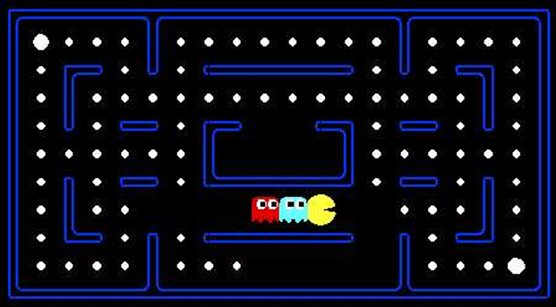
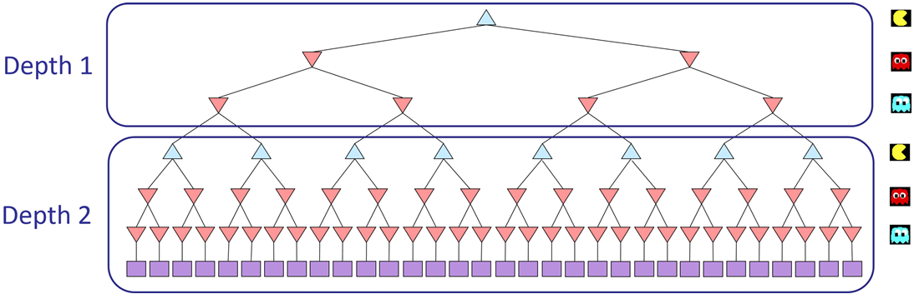

# Lab exercises: Multi-Agent Search

<p align="center">
	
</p>
<p align="center">
	Pacman, now with ghosts. Minimax, Expectimax, Evaluation
</p>


Code: [Link](./multiagent.zip)

------

## Introduction

In this project, you will design agents for the classic version of Pacman, including ghosts. Along the way, you will implement both minimax and expectimax search and try your hand at evaluation function design.

As in the search projects, this project includes an autograder for you to grade your answers on your machine. This can be run on all questions with the command:

```shell
python autograder.py
```


It can be run for one particular question, such as q2, by:

```shell
python autograder.py -q q2
```


It can be run for one particular test by commands of the form:

```shell
python autograder.py -t test_cases/q2/0-small-tree
```


By default, the autograder displays graphics with the `-t` option, but doesn’t with the `-q` option. You can force graphics by using the `--graphics` flag, or force no graphics by using the `--no-graphics` flag.

| **Files you'll edit:**               |                                                              |
| ------------------------------------ | ------------------------------------------------------------ |
| `multiAgents.py`                     | Where all of your multi-agent search agents will reside.     |
| **Files you might want to look at:** |                                                              |
| `pacman.py`                          | The main file that runs Pacman games. This file also describes a Pacman GameState type, which you will use extensively in this project. |
| `game.py`                            | The logic behind how the Pacman world works. This file describes several supporting types like AgentState, Agent, Direction, and Grid. |
| `util.py`                            | Useful data structures for implementing search algorithms. You don't need to use these for this project, but may find other functions defined here to be useful. |
| **Supporting files you can ignore:** |                                                              |
| `graphicsDisplay.py`                 | Graphics for Pacman                                          |
| `graphicsUtils.py`                   | Support for Pacman graphics                                  |
| `textDisplay.py`                     | ASCII graphics for Pacman                                    |
| `ghostAgents.py`                     | Agents to control ghosts                                     |
| `keyboardAgents.py`                  | Keyboard interfaces to control Pacman                        |
| `layout.py`                          | Code for reading layout files and storing their contents     |
| `autograder.py`                      | Project autograder                                           |
| `testParser.py`                      | Parses autograder test and solution files                    |
| `testClasses.py`                     | General autograding test classes                             |
| `test_cases/`                        | Directory containing the test cases for each question        |
| `multiagentTestClasses.py`           | Project 3 specific autograding test classes                  |


------


To start the project run the provided ReflexAgent in multiAgents.py

```shell
python pacman.py -p ReflexAgent
```


Note that it plays quite poorly even on simple layouts:

```shell
python pacman.py -p ReflexAgent -l testClassic
```


Inspect its code (in `multiAgents.py`) and make sure you understand what it’s doing.

------

## Q1: Reflex Agent

Improve the `ReflexAgent` in `multiAgents.py` to play respectably. The provided reflex agent code provides some helpful examples of methods that query the `GameState` for information. A capable reflex agent will have to consider both food locations and ghost locations to perform well. Your agent should easily and reliably clear the `testClassic` layout:

```
python pacman.py -p ReflexAgent -l testClassic
```


Try out your reflex agent on the default `mediumClassic` layout with one ghost or two (and animation off to speed up the display):

```
python pacman.py --frameTime 0 -p ReflexAgent -k 1
```


```
python pacman.py --frameTime 0 -p ReflexAgent -k 2
```


How does your agent fare? It will likely often die with 2 ghosts on the default board, unless your evaluation function is quite good.

*Note*: Remember that `newFood` has the function `asList()`

*Note*: As features, try the reciprocal of important values (such as distance to food) rather than just the values themselves.

*Note*: The evaluation function you’re writing is evaluating state-action pairs; in later parts of the project, you’ll be evaluating states.

*Note*: You may find it useful to view the internal contents of various objects for debugging. You can do this by printing the objects’ string representations. For example, you can print `newGhostStates` with `print(newGhostStates)`.

Options: Default ghosts are random; you can also play for fun with slightly smarter directional ghosts using `-g DirectionalGhost`. If the randomness is preventing you from telling whether your agent is improving, you can use `-f` to run with a fixed random seed (same random choices every game). You can also play multiple games in a row with `-n`. Turn off graphics with `-q` to run lots of games quickly.

*Grading*: We will run your agent on the `openClassic` layout 10 times. You will receive 0 points if your agent times out, or never wins. You will receive 1 point if your agent wins at least 5 times, or 2 points if your agent wins all 10 games. You will receive an additional 1 point if your agent’s average score is greater than 500, or 2 points if it is greater than 1000. You can try your agent out under these conditions with

```
python autograder.py -q q1
```


To run it without graphics, use:

```
python autograder.py -q q1 --no-graphics
```

------

## Q2: Minimax

Now you will write an adversarial search agent in the provided `MinimaxAgent` class stub in `multiAgents.py`. Your minimax agent should work with any number of ghosts, so you’ll have to write an algorithm that is slightly more general than what you’ve previously seen in lecture. In particular, your minimax tree will have multiple min layers (one for each ghost) for every max layer.

Your code should also expand the game tree to an arbitrary depth. Score the leaves of your minimax tree with the supplied `self.evaluationFunction`, which defaults to `scoreEvaluationFunction`. `MinimaxAgent` extends `MultiAgentSearchAgent`, which gives access to `self.depth` and `self.evaluationFunction`. Make sure your minimax code makes reference to these two variables where appropriate as these variables are populated in response to command line options.

*Important*: A single search ply is considered to be one Pacman move and all the ghosts’ responses, so depth 2 search will involve Pacman and each ghost moving two times (see diagram below).



*Grading*: We will be checking your code to determine whether it explores the correct number of game states. This is the only reliable way to detect some very subtle bugs in implementations of minimax. As a result, the autograder will be very picky about how many times you call `GameState.generateSuccessor`. If you call it any more or less than necessary, the autograder will complain. To test and debug your code, run

```shell
python autograder.py -q q2
```


This will show what your algorithm does on a number of small trees, as well as a pacman game. To run it without graphics, use:

```shell
python autograder.py -q q2 --no-graphics
```


**Hints and Observations:**

- Implement the algorithm recursively using helper function(s).

- The correct implementation of minimax will lead to Pacman losing the game in some tests. This is not a problem: as it is correct behaviour, it will pass the tests.

- The evaluation function for the Pacman test in this part is already written (`self.evaluationFunction`). You shouldn’t change this function, but recognize that now we’re evaluating states rather than actions, as we were for the reflex agent. Look-ahead agents evaluate future states whereas reflex agents evaluate actions from the current state.

- The minimax values of the initial state in the `minimaxClassic` layout are 9, 8, 7, -492 for depths 1, 2, 3 and 4 respectively. Note that your minimax agent will often win (665/1000 games for us) despite the dire prediction of depth 4 minimax.

  ```shell
  python pacman.py -p MinimaxAgent -l minimaxClassic -a depth=4
  ```
  
  

- Pacman is always agent 0, and the agents move in order of increasing agent index.

- All states in minimax should be `GameStates`, either passed in to `getAction` or generated via `GameState.generateSuccessor`. In this project, you will not be abstracting to simplified states.

- On larger boards such as `openClassic` and `mediumClassic` (the default), you’ll find Pacman to be good at not dying, but quite bad at winning. He’ll often thrash around without making progress. He might even thrash around right next to a dot without eating it because he doesn’t know where he’d go after eating that dot. Don’t worry if you see this behavior, later excersizes will clean up all of these issues.


  ```shell
    python pacman.py -p MinimaxAgent -l trappedClassic -a depth=3
  ```


-----

These exercises are heavily based on the projects from [Introduction to Artificial Intelligence at UC Berkeley](https://ai.berkeley.edu/home).

