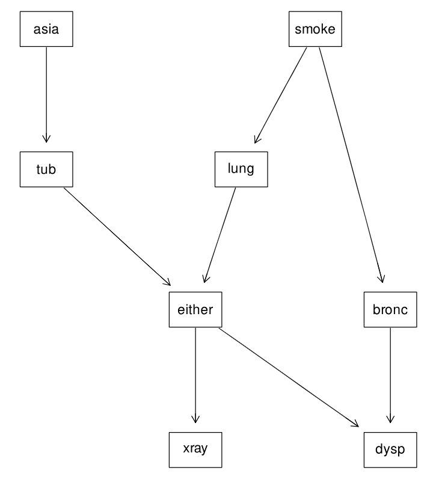

# Exercise 1 : Bayesian Networks - Sampling

---

## Introduction

In this exercise you will implement **sampling algorithms** for **Bayesian Networks**.  
We will use the **Asia network**,  an example used to study probabilistic inference.  
The network structure is shown below.



Each node represents a binary variable (e.g. `smoke`, `tub`, `either`, `xray`),  
and directed edges indicate conditional dependencies.  
You can find the full network definition in the file `asia.net`.

The goal of this exercise is to approximate conditional probabilities such as   
P(either=yes |xray=yes)
using rejection sampling.

---

## Files

- **bn.py** — defines the `DiscreteBN` class for loading and working with Bayesian Networks.  
- **sampling.py** — contains the functions you will complete:
  - `rejection_sampling`
- **run_prior.py** — runs prior sampling and prints random samples from the network.  
- **run_ex1.py** — runs rejection sampling experiments.  
- **run_ex2.py** — runs likelihood weighting experiments for the graded assignment.

---

## Q1 : Prior Sampling

Before doing rejection sampling, it is useful to see how prior sampling works.  
The function `prior_sample` is already implemented.  
It generates a random full assignment by sampling all variables in topological order.

Run the following to view a few generated samples:

```bash
python run_prior.py --N 5
```

You should see output like:

```
asia=no, smoke=no, tub=yes, lung=no, bronc=yes, ...
```

---

## Q2 : Rejection Sampling

Implement the function `rejection_sampling(bn, query, evidence, N, rng)` in **sampling.py**.

It should:
1. Generate `N` random samples .  
2. Keep only those consistent with all evidence variables.  
3. Count how many of the kept samples satisfy the query.  
4. Return the estimated probability.

Run it with:

```bash
python run_ex1.py --qvar either --qval yes --e xray=yes --N 5000
```

---

## Q3 : Analysis

**Question:**  
How large does `N` need to be for the estimates to become stable?  
Try different values of `N` (e.g. 10, 100, 1 000, 5 000, 20 000) and compare:  
- the accuracy ,  
- and how many samples are effectively used in rejection sampling (i.e., not discarded).


