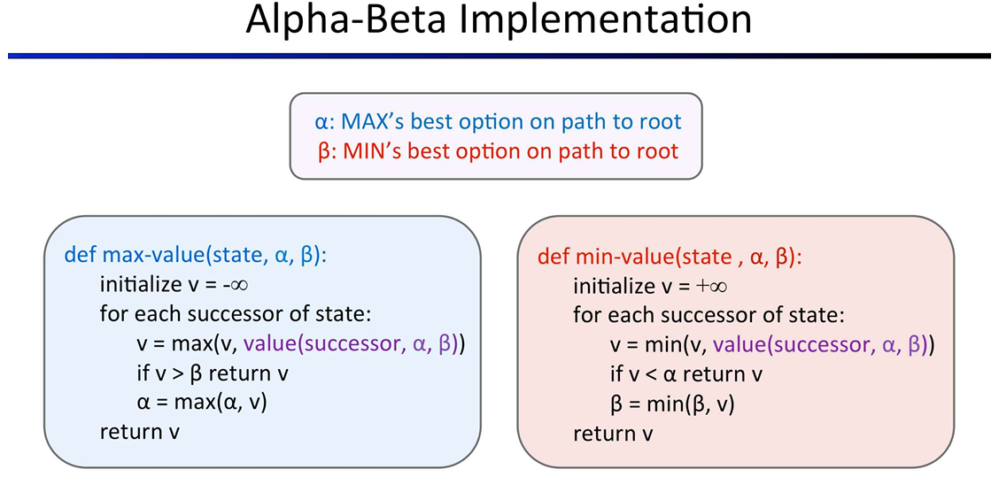

# Project 1 : Multi-Agent Search


------

## Introduction


This part of the project builds on the exercises from the third lab session  
([03adversarialSearch — Adversarial Search](../../../03adversarialSearch/pacman/README.md)).

You can continue working in the same files and submit them for grading.  
Only the functions related to the graded assignments will be evaluated; all other parts of your code will be ignored during grading.

The numbering of the questions in this document do not correspond to the question numbers used by the autograder.


------

## Q2: Alpha-Beta Pruning (autograder question 3)

Make a new agent that uses alpha-beta pruning to more efficiently explore the minimax tree, in `AlphaBetaAgent`. Again, your algorithm will be slightly more general than the pseudocode from lecture, so part of the challenge is to extend the alpha-beta pruning logic appropriately to multiple minimizer agents.

You should see a speed-up (perhaps depth 3 alpha-beta will run as fast as depth 2 minimax). Ideally, depth 3 on `smallClassic` should run in just a few seconds per move or faster.

```shell
python pacman.py -p AlphaBetaAgent -a depth=3 -l smallClassic
```


The `AlphaBetaAgent` minimax values should be identical to the `MinimaxAgent` minimax values, although the actions it selects can vary because of different tie-breaking behavior. Again, the minimax values of the initial state in the `minimaxClassic` layout are 9, 8, 7 and -492 for depths 1, 2, 3 and 4 respectively.

*Grading*: Because we check your code to determine whether it explores the correct number of states, it is important that you perform alpha-beta pruning without reordering children. In other words, successor states should always be processed in the order returned by `GameState.getLegalActions`. Again, do not call `GameState.generateSuccessor` more than necessary.

**You must not prune on equality in order to match the set of states explored by our autograder.** (Indeed, alternatively, but incompatible with our autograder, would be to also allow for pruning on equality and invoke alpha-beta once on each child of the root node, but this will not match the autograder.)

The pseudo-code below represents the algorithm you should implement for this question.



To test and debug your code, run

```shell
python autograder.py -q q3
```


This will show what your algorithm does on a number of small trees, as well as a pacman game. To run it without graphics, use:

```shell
python autograder.py -q q3 --no-graphics
```


The correct implementation of alpha-beta pruning will lead to Pacman losing some of the tests. This is not a problem: as it is correct behaviour, it will pass the tests.

------

## Q3: Expectimax (autograder question 4)

Minimax and alpha-beta are great, but they both assume that you are playing against an adversary who makes optimal decisions. As anyone who has ever won tic-tac-toe can tell you, this is not always the case. In this question you will implement the `ExpectimaxAgent`, which is useful for modeling probabilistic behavior of agents who may make suboptimal choices.

As with the search and problems yet to be covered in this class, the beauty of these algorithms is their general applicability. To expedite your own development, we’ve supplied some test cases based on generic trees. You can debug your implementation on small the game trees using the command:

```shell
python autograder.py -q q4
```


Debugging on these small and manageable test cases is recommended and will help you to find bugs quickly.

Once your algorithm is working on small trees, you can observe its success in Pacman. Random ghosts are of course not optimal minimax agents, and so modeling them with minimax search may not be appropriate. `ExpectimaxAgent` will no longer take the min over all ghost actions, but the expectation according to your agent’s model of how the ghosts act. To simplify your code, assume you will only be running against an adversary which chooses amongst their `getLegalActions` uniformly at random.

To see how the ExpectimaxAgent behaves in Pacman, run:

```shell
python pacman.py -p ExpectimaxAgent -l minimaxClassic -a depth=3
```


You should now observe a more cavalier approach in close quarters with ghosts. In particular, if Pacman perceives that he could be trapped but might escape to grab a few more pieces of food, he’ll at least try. Investigate the results of these two scenarios:

```shell
python pacman.py -p AlphaBetaAgent -l trappedClassic -a depth=3 -q -n 10
```


```shell
python pacman.py -p ExpectimaxAgent -l trappedClassic -a depth=3 -q -n 10
```


You should find that your `ExpectimaxAgent` wins about half the time, while your `AlphaBetaAgent` always loses. Make sure you understand why the behavior here differs from the minimax case.

The correct implementation of expectimax will lead to Pacman losing some of the tests. This is not a problem: as it is correct behaviour, it will pass the tests.

-----

## Q4: Evaluation Function (autograder question 5)

Write a better evaluation function for Pacman in the provided function `betterEvaluationFunction`. The evaluation function should evaluate states, rather than actions like your reflex agent evaluation function did. With depth 2 search, your evaluation function should clear the `smallClassic` layout with one random ghost more than half the time and still run at a reasonable rate (to get full credit, Pacman should be averaging around 1000 points when he’s winning).

*Grading*: the autograder will run your agent on the smallClassic layout 10 times. We will assign points to your evaluation function in the following way:

- If you win at least once without timing out the autograder, you receive 1 point. Any agent not satisfying these criteria will receive 0 points.
- +1 for winning at least 5 times, +2 for winning all 10 times
- +1 for an average score of at least 500, +2 for an average score of at least 1000 (including scores on lost games)
- +1 if your games take on average less than 30 seconds on the autograder machine, when run with `--no-graphics`.
- The additional points for average score and computation time will only be awarded if you win at least 5 times.
- Please do not copy any files from Project 1, as it will not pass the autograder on Gradescope.

You can try your agent out under these conditions with

```shell
python autograder.py -q q5
```


To run it without graphics, use:

```shell
python autograder.py -q q5 --no-graphics
```


------

These exercises are heavily based on the projects from [Introduction to Artificial Intelligence at UC Berkeley](https://ai.berkeley.edu/home.html).

